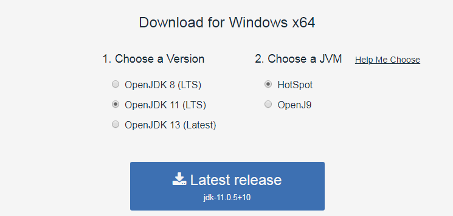
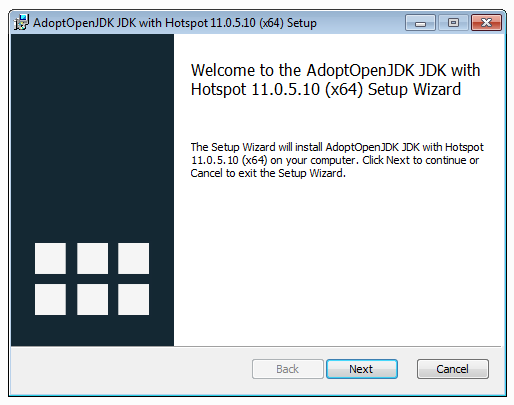
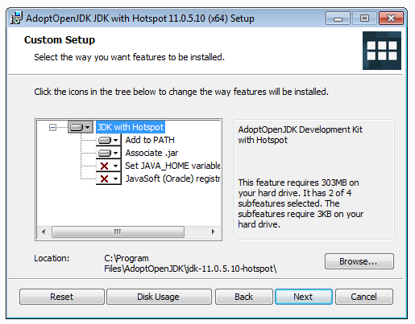
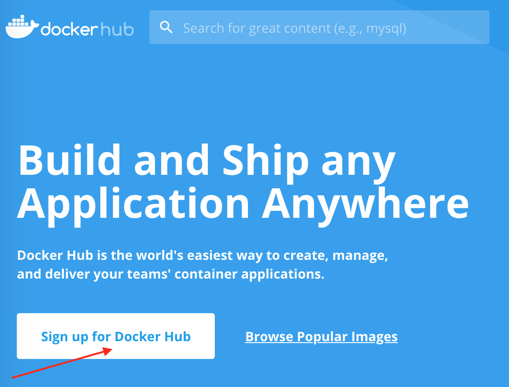

Для запуска тестов понадобится следущее ПО:

## OpenJDK11

<details>
   <summary>Инструкция по установке OpenJDK11</summary>

### Windows

Шаг 1. Перейдите на сайт [adoptopenjdk.net](https://adoptopenjdk.net). 

Шаг 2. Выберите опции как на скриншоте ниже и нажмите на кнопку скачивания:



Шаг 3. Запустите на установку скачанный MSI-файл и нажмите кнопку "Next":



Шаг 4. Прочитайте и согласитесь с условиями лицензии:


Шаг 5. Выберите опции как на экране (удостоверьтесь, что установка происходит в `Program Files` и опция `Add to PATH` выбрана):



Шаг 6. Нажмите на кнопку "Install":


Шаг 7. Дождитесь окончания установки и нажмите на кнопку "Finish":


Откройте терминал и выполните команду:
```shell script
java -version
```

```
openjdk version "11.0.5" 2019-10-15
OpenJDK Runtime Environment AdoptOpenJDK (build 11.0.5+10)
OpenJDK 64-Bit Server VM AdoptOpenJDK (build 11.0.5+10, mixed mode)
```

**Важно**: вы должны открывать терминал уже после того, как произвели установку.

### MacOS

Шаг 1. Перейдите на сайт [adoptopenjdk.net](https://adoptopenjdk.net). 

Шаг 2. Выберите опции как на скриншоте ниже и нажмите на кнопку скачивания:


Шаг 3. Запустите на установку скачанный PKG-файл и нажмите кнопку "Продолжить":


Шаг 4. Прочитайте и согласитесь с условиями лицензии:


Шаг 5. Выберите диск для установки:


Шаг 6. Нажмите на кнопку "Установить":


Шаг 7. Дождитесь окончания установки и нажмите на кнопку "Закрыть":


Откройте терминал и выполните команду:
```shell script
java -version
```
Вы должны увидеть вывод подобный:
```
openjdk version "11.0.5" 2019-10-15
OpenJDK Runtime Environment AdoptOpenJDK (build 11.0.5+10)
OpenJDK 64-Bit Server VM AdoptOpenJDK (build 11.0.5+10, mixed mode)
```

**Важно**: вы должны открывать терминал уже после того, как произвели установку.

### Linux

Указанные инструкции приведены для дистрибутива Ubuntu 18.04+. Если у вас другой дистрибутив Linux - пишите в канал Slack.

Откройте консоль (`Ctrl + Alt + T` в Ubuntu 18+). В консоли выполните следующие команды:

```shell script
sudo apt update
sudo apt install openjdk-11-jdk openjdk-11-source
```

Удостоверьтесь, что java установлена:
```shell script
java -version
```

Вы должны увидеть вывод подобный:
```
openjdk version "11.0.5" 2019-10-15
OpenJDK Runtime Environment (build 11.0.5+10-post-Ubuntu-0ubuntu1.1)
OpenJDK 64-Bit Server VM (build 11.0.5+10-post-Ubuntu-0ubuntu1.1, mixed mode, sharing)
```

</details>

## IntelliJ IDEA

<details>
   <summary>Инструкция по установке IntelliJ IDEA</summary>

### Установка IntelliJ IDEA

**Важно**: если у вас что-то не получилось, то оформляйте Issue [по установленным правилам](../report-requirements.md).

Шаг 1. Перейдите по адресу https://www.jetbrains.com/toolbox/app/, выберите необходиму ОС и нажмите кнопку "Скачать":


Шаг 2. Запустите скачанный файл и нажмите кнопку "Установить":


Шаг 3. Дождитесь завершения установки и нажмите кнопку "Готово" (флажок "Запустить JetBrains Toolbox" должен быть выставлен):


Шаг 4. Иконка Toolbox появится в системном трее, кликните на ней левой кнопкой мыши:


Шаг 5. Прочитайте лицензионное соглашение и нажмите кнопку "Accept":


Шаг 6. Нажмите "Install" для "IntelliJ IDEA Community":


Шаг 7. Дождитесь завершения установки и нажмите на кнопку запуска "IntelliJ IDEA Community":


Шаг 8. Если вы до этого не пользовались IntelliJ IDEA (и у вас нет сохранённых настроек) выберите опцию "Do not import settings", затем кнопку "OK":


Шаг 9. Согласитесь с "Privacy Policy" и нажмите кнопку "Continue":


Шаг 10. При желании вы можете отправлять данные об использовании IntelliJ IDEA в компанию IDEA (выберите любую из опций: "Send ..." - отправлять, "Don't send" - не отправлять):


Шаг 11. Выберите по своим предпочтениям тему оформления (тёмную "Darcula" или светлую "Light") и нажмите на кнопку "Skip Remaining and Set Defaults":


Шаг 12. Дождитесь появления стартового окна и выберите "Create New Project":


Шаг 13. Удостоверьтесь, что при выборе "Java" в списке есть "11 (java version "11.x.x")" или другая установленная на предыдущих лекциях версия джавы и нажмите на кнопку "Next":


Шаг 14. Нажмите "Next":


Шаг 15. Оставьте значение полей по умолчанию, предварительно убедившись, что в пути к проекту нет никаких кириллических символов или пробелов (если же они там есть - измените путь с помощью кнопки `...`, например, на `C:/Projects/untitled`) и нажмите "Finish":


Шаг 16. Чтобы не получать при каждом запуске подсказок по использованию IntelliJ IDEA, снимите флажок "Show tips on startup" и нажмите кнопку "Close": 


Шаг 17. При первом запуске IntelliJ IDEA понадобится какое-то время, чтобы проиндексировать вашу установку JDK, подождите, пока все процессы завершатся:


Поздравляем! Вы успешно установили IntelliJ IDEA.

</details>

## Plugin IDEA

<details>
   <summary>Инструкция по установке Plugin IDEA</summary>

### Установка Plugin IDEA

Этот раздел не является обязательным, но он позволяет вам облегчить себе взаимодействие с Docker и Docker Compose на первое время, воспользовавшись графическим интерфейсом.

Откройте IntelliJ IDEA, перейдите в раздел настроек:
* Windows/Linux: File -> Settings
* MacOS: IntelliJ IDEA -> Preferences

Найдите в поиске раздел Plugins:


Нажмите на кнопку `Install`, после установке перезапустите IDEA.

Теперь при открытии файлов `Dockerfile`, `docker-compose.yml` IDEA будет предлагать автодополнение и возможность запуска прямо из окна редактора:


После запуска откроется окно `Services`, где вы можете посмотреть образы, контейнеры и запущенные с помощью Docker Compose сервисы:


</details>

## Docker

<details>
   <summary>Инструкция по установке Docker</summary>

### Установка Docker
  
1. Зарегистрироваться (получить Docker ID) на [Docker Hub](https://hub.docker.com/).

Выбираете `Sign Up`:



Заполняете форму, регистрируйтесь.

2. Определиться с вашей ОС и версией:
* Пользователи Windows 8, 7 - вам нужен Docker Toolbox. Скачать [здесь](https://github.com/docker/toolbox/releases)
* Пользователи Windows 10 - вам нужен Docker Desktop. Установка описана [здесь](https://docs.docker.com/docker-for-windows/install/).
* Пользователи MacOS (год выпуска 2010+ и ОС 10.13 и выше) - вам нужен Docker Desktop. Установка описана [здесь](https://docs.docker.com/docker-for-mac/install/)
* Пользователи Linux, в зависимости от дистрибутива: [Ubuntu](https://docs.docker.com/install/linux/docker-ce/ubuntu/), [Debian](https://docs.docker.com/install/linux/docker-ce/debian/). Не забудьте так же про [Post Installation](https://docs.docker.com/install/linux/linux-postinstall/)

**Важно**: замечание для пользователей Docker Toolbox на Windows - вам вместо localhost придётся писать `192.168.99.100`. Это ip виртуальной linux машины, в которой уже и запускается docker.

Если работать не будет, то выполните в консоли команду `docker-machine ip default` и увидите адрес (его нужно будет использовать во всех примерах вместо `localhost`).

</details>
