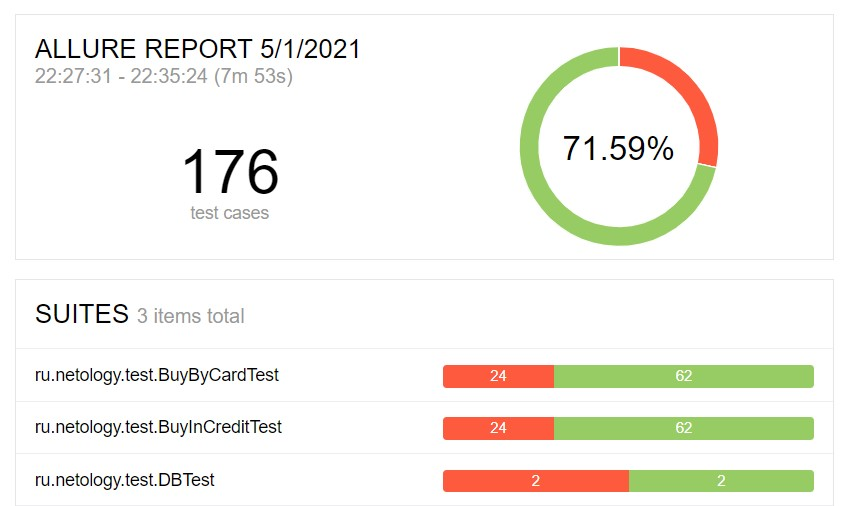

# Отчет по итогам тестирования

## Краткое описание

Проведено тестировнаие веб-сервиса в период с 19.04.2021 по 23.04.2021 согласно [плану](Plan.md).

* В ходе автоматизации тестирования были реализованы позитивные и негативные сценарии заполнения тестовых страниц.
* Подтверждена поддержка двух БД - MySQL и PostgreSQL.

Протестирована возможность собственной СУБД сохранять информацию о том, каким способом был совершён платёж и успешно ли он был совершён.

## Тест-кейсы

Количество тест-кейсов — 176:
- для страницы "Купить" — 86;
- для страницы "Купить в кредит" — 86;
- для БД — 4.

Результат прогона тест-кейсов:

## Общие рекомендации

По результатам тестирования, рекомендуется:

- Создать спецификацию для данного приложения.
- Исправить описанные баги (20):

    

      
Для страницы "Путешествие дня

      - [Орфографическая ошибка в названии города на странице "Путешествие дня"](https://github.com/ks1109b/DiplomaProject/issues/1)
      - [Название вкладки на странице "Путешествие дня" не соответствует содержанию](https://github.com/ks1109b/DiplomaProject/issues/2)
      

   
    

      
Для страницы "Купить"

      - [Текст ошибки под пустыми полями не отображает сути на вкладке "Купить"](https://github.com/ks1109b/DiplomaProject/issues/3)
      - [На вкладке "Купить" текст ошибки под полем не исчезает при исправлении](https://github.com/ks1109b/DiplomaProject/issues/5)
      - [На вкладке "Купить" текст ошибки под полями "Номер карты", "Владелец", "CVC/CVV" не исчезает при отправке формы](https://github.com/ks1109b/DiplomaProject/issues/7)
      - [На вкладке "Купить" при отправке формы с пустым полем "CVC/CVV" ошибка отображается под несколькими полями](https://github.com/ks1109b/DiplomaProject/issues/9)
      - [Возможно отправить невалидное значение в поле "Владелец" на странице "Купить"](https://github.com/ks1109b/DiplomaProject/issues/11)
      - [Возможно отправить невалидное значение в поле "Месяц" на странице "Купить"](https://github.com/ks1109b/DiplomaProject/issues/13)
      - [Неверное сообщение при отправке формы с отклоненной картой на странице "Купить"](https://github.com/ks1109b/DiplomaProject/issues/15)
      - [При отказе банком выпадает сообщение, как об ошибке, так и об успехе на вкладке "Купить"](https://github.com/ks1109b/DiplomaProject/issues/17)
      

   
    

      
Для страницы "Купить в кредит"

      - [Текст ошибки под пустыми полями не отображает сути на вкладке "Купить в кредит"](https://github.com/ks1109b/DiplomaProject/issues/4)
      - [На вкладке "Купить в кредит" текст ошибки под полем не исчезает при исправлении](https://github.com/ks1109b/DiplomaProject/issues/6)
      - [На вкладке "Купить в кредит" текст ошибки под полями "Номер карты", "Владелец", "CVC/CVV" не исчезает при отправке формы](https://github.com/ks1109b/DiplomaProject/issues/8)
      - [На вкладке "Купить в кредит" при отправке формы с пустым полем "CVC/CVV" ошибка отображается под несколькими полями](https://github.com/ks1109b/DiplomaProject/issues/10)
      - [Возможно отправить невалидное значение в поле "Владелец" на странице "Купить в кредит"](https://github.com/ks1109b/DiplomaProject/issues/12)
      - [Возможно отправить невалидное значение в поле "Месяц" на странице "Купить в кредит"](https://github.com/ks1109b/DiplomaProject/issues/14)
      - [Неверное сообщение при отправке формы с отклоненной картой на странице "Купить в кредит"](https://github.com/ks1109b/DiplomaProject/issues/16)
      - [При отказе банком выпадает сообщение, как об ошибке, так и об успехе на вкладке "Купить в кредит"](https://github.com/ks1109b/DiplomaProject/issues/18)
      

   
    

      
Для БД

      - [Запись в базе данных отображается не в своей ячейке при покупке в кредит одобренной картой](https://github.com/ks1109b/DiplomaProject/issues/19)
      - [Запись в базе данных отображается не в своей ячейке при покупке в кредит отклоненной картой](https://github.com/ks1109b/DiplomaProject/issues/20)
      

